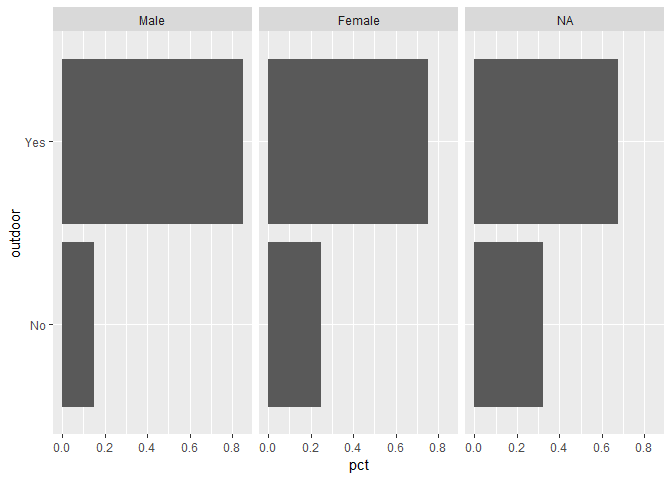
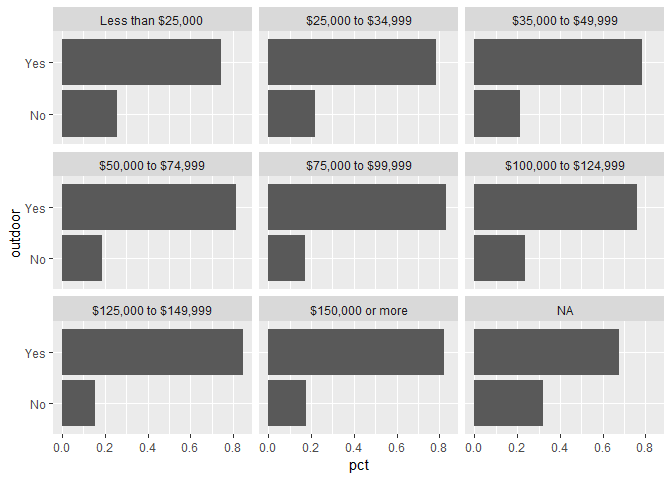
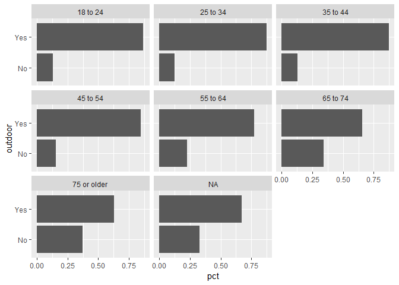
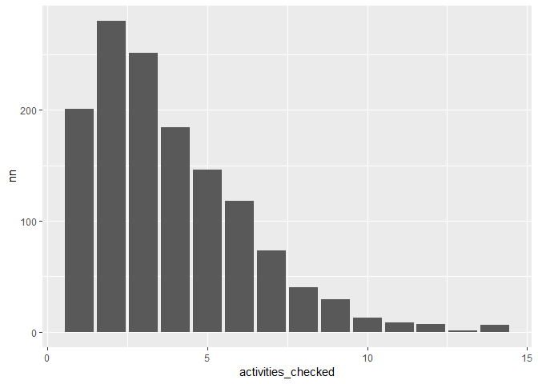

explore-act-rates.R
================
danka
Wed Jan 29 15:48:01 2020

``` r
# some initial work in activity rates (screener)

library(tidyverse)
source("R/prep-svy.R") # functions
svy <- readRDS("data-work/1-svy/svy-reshape.rds")

# How many passed screener?
acts_of_interest <- unique(svy$basin$act)
filter(svy$act, part == "Checked", act %in% acts_of_interest) %>%
    distinct(Vrid) %>%
    nrow()
```

    ## [1] 1347

``` r
# - exclude picnicking
acts_of_interest <- setdiff(acts_of_interest, "picnic")
outdoors <- filter(svy$act, part == "Checked", act %in% acts_of_interest) %>%
    distinct(Vrid) %>%
    mutate(outdoor = "Yes")
nrow(outdoors)
```

    ## [1] 1201

``` r
# - also exclude wildlife
acts_of_interest <- setdiff(acts_of_interest, "wildlife")
outdoors <- filter(svy$act, part == "Checked", act %in% acts_of_interest) %>%
    distinct(Vrid) %>%
    mutate(outdoor = "Yes")
nrow(outdoors)
```

    ## [1] 1080

``` r
# - check by demographics
svy$person <- left_join(svy$person, outdoors, by = "Vrid") %>%
    mutate(outdoor = ifelse(is.na(outdoor), "No", outdoor))

plot_choice(svy$person, outdoor, sex) + facet_wrap(~ sex)
```

<!-- -->

``` r
plot_choice(svy$person, outdoor, race) + facet_wrap(~ race)
```

<!-- -->

``` r
plot_choice(svy$person, outdoor, income) + facet_wrap(~ income)
```

<!-- -->

``` r
plot_choice(svy$person, outdoor, age) + facet_wrap(~ age)
```

<!-- -->

``` r
# checked all
# - fewer than 10 respondents did this
filter(svy$act, act != "none", part == "Checked") %>%
    count(Vrid) %>%
    count(n) %>%
    rename(activities_checked = n) %>%
    ggplot(aes(activities_checked, nn)) +
    geom_col()
```

<!-- -->
