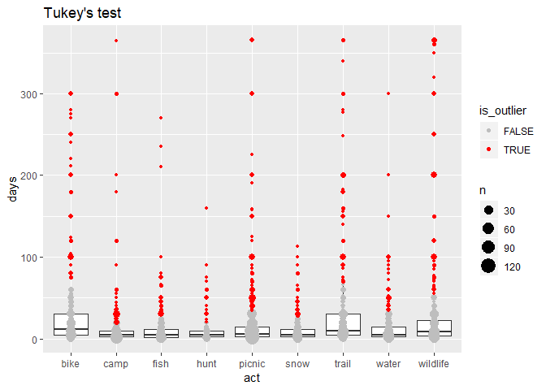
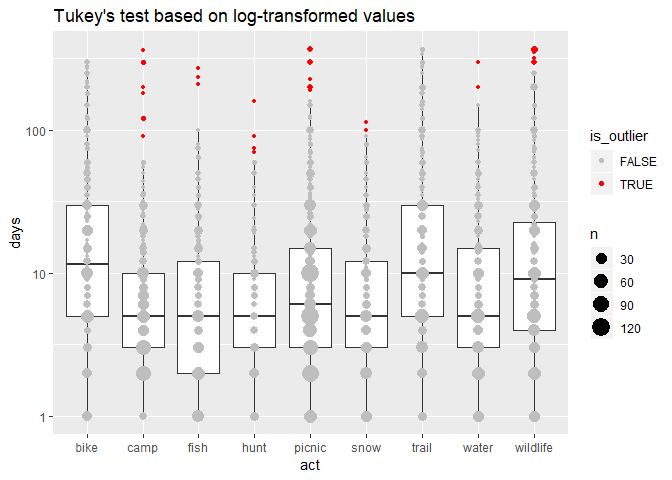

Test outlier identification with Tukey’s Rule
================
January 31, 2020

``` r
library(tidyverse)
source("../../R/outliers.R")
knitr::opts_chunk$set(comment = NA)
```

## Tukey’s Test

We can apply [Tukey’s test]() to identify outliers for overall days by
activity. We end up with a rule that is very aggressive in identifying
outliers.

``` r
svy <- readRDS("../../data-work/1-svy/svy-weight.rds")

# only looking at days greater than zero
days <- svy$act %>% 
    filter(is_targeted, !is.na(days), days > 0)

# identify outliers
x <- days %>%
    group_by(act) %>%
    mutate(is_outlier = tukey_outlier(days)) %>%
    ungroup()

# plot
ggplot(x, aes(act, days)) +
    geom_boxplot(outlier.size = -1) +
    geom_point(data = count(x, act, days, is_outlier), aes(size = n, color = is_outlier)) +
    scale_color_manual(values = c("gray", "red")) +
    ggtitle("Tukey's test")
```

<!-- -->

A very large percentage are flagged for removal in every activity

``` r
group_by(x, act, is_outlier) %>%
    summarise(n = n()) %>%
    mutate(pct_outliers = n / sum(n) * 100) %>%
    filter(is_outlier)
```

    # A tibble: 9 x 4
    # Groups:   act [9]
      act      is_outlier     n pct_outliers
      <chr>    <lgl>      <int>        <dbl>
    1 bike     TRUE          46        12.0 
    2 camp     TRUE          55        11.5 
    3 fish     TRUE          33         9.85
    4 hunt     TRUE          17        10.5 
    5 picnic   TRUE          88         9.64
    6 snow     TRUE          27         8.68
    7 trail    TRUE          50        11.7 
    8 water    TRUE          30         7.79
    9 wildlife TRUE          63        12.0 

## Log-transfrom with Tukey’s Test

This is a much less aggressive rule.

``` r
# identify outliers
x <- days %>%
    group_by(act) %>%
    mutate(is_outlier = tukey_outlier(days, apply_log = TRUE)) %>%
    ungroup()

# plot
ggplot(x, aes(act, days)) +
    geom_boxplot(outlier.size = -1) +
    geom_point(data = count(x, act, days, is_outlier), aes(size = n, color = is_outlier)) +
    scale_color_manual(values = c("gray", "red")) +
    scale_y_log10() +
    ggtitle("Tukey's test based on log-transformed values")
```

<!-- -->

We end up with a far lower percentage flagged as outliers

``` r
group_by(x, act, is_outlier) %>%
    summarise(n = n()) %>%
    mutate(pct_outliers = n / sum(n) * 100) %>%
    filter(is_outlier)
```

    # A tibble: 7 x 4
    # Groups:   act [7]
      act      is_outlier     n pct_outliers
      <chr>    <lgl>      <int>        <dbl>
    1 camp     TRUE           8        1.67 
    2 fish     TRUE           3        0.896
    3 hunt     TRUE           4        2.47 
    4 picnic   TRUE          16        1.75 
    5 snow     TRUE           2        0.643
    6 water    TRUE           2        0.519
    7 wildlife TRUE          14        2.67
