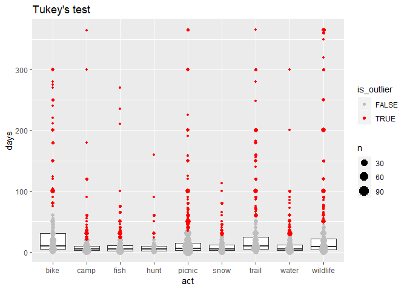
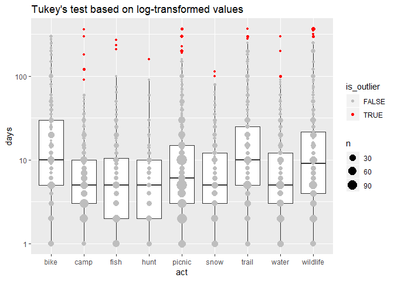

Test outlier identification with Tukey’s Rule
================
January 31, 2020

``` r
library(tidyverse)
source("../../R/outliers.R")
svy <- readRDS("../../data-work/1-svy/svy-weight.rds")

# exclude suspicious respondents
suspicious <- filter(svy$person, flag > 3)
svy <- lapply(svy, function(df) anti_join(df, suspicious, by = "Vrid"))
```

## Tukey’s Test

We can apply [Tukey’s
test](https://en.wikipedia.org/wiki/Outlier#Tukey%27s_fences) to
identify outliers for overall days by activity. We end up with a rule
that is very aggressive in identifying outliers.

``` r
# identify outliers
days <- svy$act %>%
    group_by(act) %>%
    mutate(
        is_outlier = tukey_outlier(days, ignore_zero = TRUE),
        days_cleaned = ifelse(is_outlier, NA, days)
    ) %>%
    ungroup()

# plot
x <- filter(days, is_targeted, !is.na(days), days > 0)
x %>%
    ggplot(aes(act, days)) +
    geom_boxplot(outlier.size = -1) +
    geom_point(data = count(x, act, days, is_outlier), aes(size = n, color = is_outlier)) +
    scale_color_manual(values = c("gray", "red")) +
    ggtitle("Tukey's test")
```

<!-- -->

A very large percentage are flagged for removal in every activity

``` r
group_by(x, act, is_outlier) %>%
    summarise(n = n()) %>%
    mutate(pct_outliers = n / sum(n) * 100) %>%
    filter(is_outlier) %>%
    knitr::kable()
```

| act      | is\_outlier |  n | pct\_outliers |
| :------- | :---------- | -: | ------------: |
| bike     | TRUE        | 38 |     11.176471 |
| camp     | TRUE        | 46 |     10.623557 |
| fish     | TRUE        | 34 |     11.333333 |
| hunt     | TRUE        | 10 |      6.896552 |
| picnic   | TRUE        | 82 |      9.545984 |
| snow     | TRUE        | 24 |      8.727273 |
| trail    | TRUE        | 51 |     13.110540 |
| water    | TRUE        | 41 |     11.581921 |
| wildlife | TRUE        | 68 |     14.107884 |

The outlier flagging has a very large effect on averages.

``` r
days %>%
    filter(is_targeted) %>%
    group_by(act) %>%
    summarise_at(vars(days, days_cleaned), funs(mean(., na.rm = TRUE))) %>%
    knitr::kable()
```

| act      |      days | days\_cleaned |
| :------- | --------: | ------------: |
| bike     | 31.581395 |     14.885621 |
| camp     | 11.163218 |      6.102828 |
| fish     | 11.640523 |      5.977941 |
| hunt     |  9.374150 |      5.941606 |
| picnic   | 17.478161 |      8.257614 |
| snow     |  9.989247 |      6.564706 |
| trail    | 28.418367 |     11.961877 |
| water    | 12.353760 |      6.754717 |
| wildlife | 30.524490 |     10.144550 |

## Log-transfrom with Tukey’s Test

This is a much less aggressive rule.

``` r
# identify outliers
days <- svy$act %>%
    group_by(act) %>%
    mutate(
        is_outlier = tukey_outlier(days, ignore_zero = TRUE, apply_log = TRUE),
        days_cleaned = ifelse(is_outlier, NA, days)
    ) %>%
    ungroup()

# plot
x <- filter(days, is_targeted, !is.na(days), days > 0)
x %>%
    ggplot(aes(act, days)) +
    geom_boxplot(outlier.size = -1) +
    geom_point(data = count(x, act, days, is_outlier), aes(size = n, color = is_outlier)) +
    scale_color_manual(values = c("gray", "red")) +
    scale_y_log10() +
    ggtitle("Tukey's test based on log-transformed values")
```

<!-- -->

``` r
group_by(x, act, is_outlier) %>%
    summarise(n = n()) %>%
    mutate(pct_outliers = n / sum(n) * 100) %>%
    filter(is_outlier) %>%
    knitr::kable()
```

| act      | is\_outlier |  n | pct\_outliers |
| :------- | :---------- | -: | ------------: |
| camp     | TRUE        |  6 |     1.3856813 |
| fish     | TRUE        |  3 |     1.0000000 |
| hunt     | TRUE        |  1 |     0.6896552 |
| picnic   | TRUE        | 15 |     1.7462165 |
| snow     | TRUE        |  2 |     0.7272727 |
| trail    | TRUE        |  4 |     1.0282776 |
| water    | TRUE        |  4 |     1.1299435 |
| wildlife | TRUE        | 13 |     2.6970954 |

The rule can still have a sizeable effect on averages:

``` r
days %>%
    filter(is_targeted) %>%
    group_by(act) %>%
    summarise_at(vars(days, days_cleaned), funs(mean(., na.rm = TRUE))) %>%
    knitr::kable()
```

| act      |      days | days\_cleaned |
| :------- | --------: | ------------: |
| bike     | 31.581395 |     31.581395 |
| camp     | 11.163218 |      8.582751 |
| fish     | 11.640523 |      9.396040 |
| hunt     |  9.374150 |      8.342466 |
| picnic   | 17.478161 |     13.095906 |
| snow     |  9.989247 |      9.292419 |
| trail    | 28.418367 |     25.502577 |
| water    | 12.353760 |     10.521127 |
| wildlife | 30.524490 |     21.828092 |

### Top-coding

Alternatively, we could topcode those values, which is a less aggressive
approach:

``` r
days2 <- days %>%
    group_by(act) %>%
    mutate(
        topcode_value = tukey_top(days, apply_log = TRUE, ignore_zero = TRUE),
        days_cleaned = ifelse(is_outlier, topcode_value, days)
    ) %>%
    ungroup()

days2 %>%
    filter(is_targeted) %>%
    group_by(act) %>%
    summarise_at(vars(days, days_cleaned), funs(mean(., na.rm = TRUE))) %>%
    knitr::kable()
```

| act      |      days | days\_cleaned |
| :------- | --------: | ------------: |
| bike     | 31.581395 |     31.581395 |
| camp     | 11.163218 |      9.303789 |
| fish     | 11.640523 |     10.532331 |
| hunt     |  9.374150 |      9.046282 |
| picnic   | 17.478161 |     15.761582 |
| snow     |  9.989247 |      9.913979 |
| trail    | 28.418367 |     28.094475 |
| water    | 12.353760 |     11.473538 |
| wildlife | 30.524490 |     28.561833 |

``` r
days2 %>%
    filter(is_targeted) %>%
    count(act, topcode_value) %>% 
    knitr::kable()
```

| act      | topcode\_value |    n |
| :------- | -------------: | ---: |
| bike     |      440.90815 | 1252 |
| camp     |       60.85806 | 1252 |
| fish     |      125.29775 | 1252 |
| hunt     |      111.80340 | 1252 |
| picnic   |      167.70510 | 1252 |
| snow     |       96.00000 | 1252 |
| trail    |      279.50850 | 1252 |
| water    |       96.00000 | 1252 |
| wildlife |      275.63832 | 1252 |
