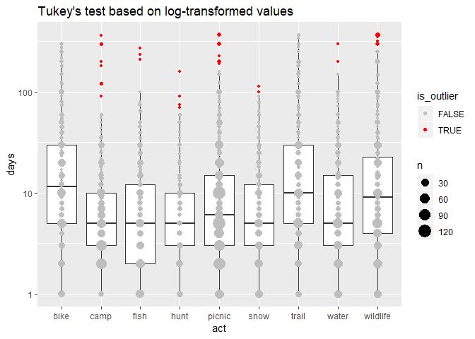

Test outlier identification with Tukey’s Rule
================
January 31, 2020

``` r
library(tidyverse)
source("../../R/outliers.R")
svy <- readRDS("../../data-work/1-svy/svy-weight.rds")
```

## Tukey’s Test

We can apply [Tukey’s
test](https://en.wikipedia.org/wiki/Outlier#Tukey%27s_fences) to
identify outliers for overall days by activity. We end up with a rule
that is very aggressive in identifying outliers.

``` r
# only looking at days greater than zero
days <- svy$act %>% 
    semi_join(filter(svy$person, flag < 4), by = "Vrid") %>%
    filter(is_targeted, !is.na(days), days > 0)
```

    Warning: Column `Vrid` has different attributes on LHS and RHS of join

``` r
# identify outliers
x <- days %>%
    group_by(act) %>%
    mutate(is_outlier = tukey_outlier(days)) %>%
    ungroup()

# plot
ggplot(x, aes(act, days)) +
    geom_boxplot(outlier.size = -1) +
    geom_point(data = count(x, act, days, is_outlier), aes(size = n, color = is_outlier)) +
    scale_color_manual(values = c("gray", "red")) +
    ggtitle("Tukey's test")
```

<!-- -->

A very large percentage are flagged for removal in every activity

``` r
group_by(x, act, is_outlier) %>%
    summarise(n = n()) %>%
    mutate(pct_outliers = n / sum(n) * 100) %>%
    filter(is_outlier) %>%
    knitr::kable()
```

| act      | is\_outlier |  n | pct\_outliers |
| :------- | :---------- | -: | ------------: |
| bike     | TRUE        | 38 |     11.176471 |
| camp     | TRUE        | 46 |     10.623557 |
| fish     | TRUE        | 34 |     11.333333 |
| hunt     | TRUE        | 10 |      6.896552 |
| picnic   | TRUE        | 81 |      9.429569 |
| snow     | TRUE        | 24 |      8.727273 |
| trail    | TRUE        | 51 |     13.110540 |
| water    | TRUE        | 41 |     11.581921 |
| wildlife | TRUE        | 68 |     14.107884 |

## Log-transfrom with Tukey’s Test

This is a much less aggressive rule.

``` r
# identify outliers
x <- days %>%
    group_by(act) %>%
    mutate(is_outlier = tukey_outlier(days, apply_log = TRUE)) %>%
    ungroup()

# plot
ggplot(x, aes(act, days)) +
    geom_boxplot(outlier.size = -1) +
    geom_point(data = count(x, act, days, is_outlier), aes(size = n, color = is_outlier)) +
    scale_color_manual(values = c("gray", "red")) +
    scale_y_log10() +
    ggtitle("Tukey's test based on log-transformed values")
```

<!-- -->

``` r
group_by(x, act, is_outlier) %>%
    summarise(n = n()) %>%
    mutate(pct_outliers = n / sum(n) * 100) %>%
    filter(is_outlier) %>%
    knitr::kable()
```

| act      | is\_outlier |  n | pct\_outliers |
| :------- | :---------- | -: | ------------: |
| camp     | TRUE        |  6 |     1.3856813 |
| fish     | TRUE        |  3 |     1.0000000 |
| hunt     | TRUE        |  1 |     0.6896552 |
| picnic   | TRUE        | 15 |     1.7462165 |
| snow     | TRUE        |  2 |     0.7272727 |
| trail    | TRUE        |  4 |     1.0282776 |
| water    | TRUE        |  4 |     1.1299435 |
| wildlife | TRUE        | 13 |     2.6970954 |
