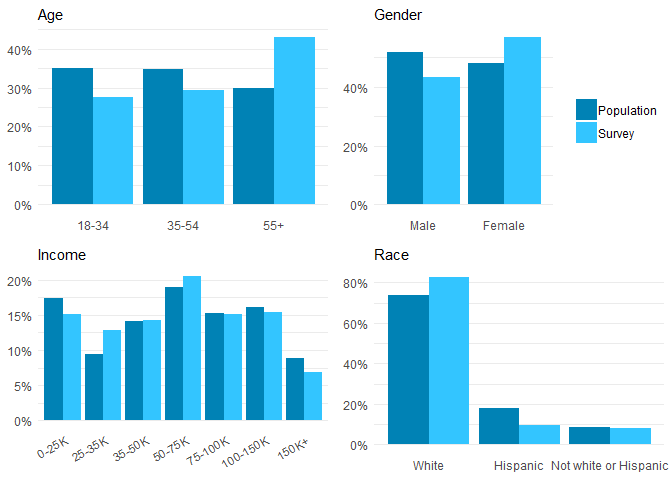

Summarize CO survey weighting
================
February 03, 2020

``` r
library(tidyverse)
source("../../R/results.R")
```

## Representation

There was a small amount of skew between the CO survey (valid)
respondents and the target population defined using the OIA survey
dataset:

``` r
svy_data <- readRDS("../../data-work/1-svy/svy-final.rds")$person
pop_data <- readRDS("../../data-work/oia/oia-co.rds") %>% filter(in_co_pop)

figs <- list(
    compare_demo(age_weight, svy_data, pop_data) %>% plot_demo(age_weight, "Age"),
    compare_demo(sex, svy_data, pop_data) %>% plot_demo(sex, "Gender", hide_legend = FALSE),
    compare_demo(income_weight, svy_data, pop_data) %>% plot_demo(income_weight, "Income", angle_x_labs = 30),
    compare_demo(race_weight, svy_data, pop_data) %>% plot_demo(race_weight, "Race")
)
fig <- gridExtra::grid.arrange(grobs = figs, ncol = 2)
```

<!-- -->

``` r
ggsave("../../out/fig/demorep.png", fig, height = 3, width = 6.5, units = "in")
```

### Weight Summary

``` r
summary(svy_data$weight)
```

``` 
   Min. 1st Qu.  Median    Mean 3rd Qu.    Max. 
 0.3568  0.7408  0.9245  1.0000  1.1662  2.6893 
```

``` r
# std. deviation
sd(svy_data$weight)
```

    [1] 0.4317299
