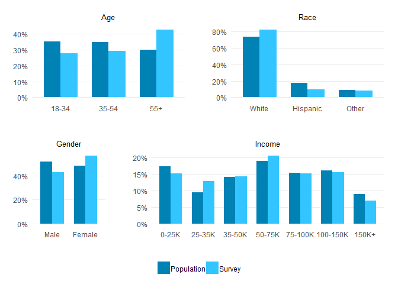

Summarize CO survey weighting
================
February 05, 2020

``` r
library(tidyverse)
source("../../R/results.R")
svy_data <- readRDS("../../data-work/1-svy/svy-final.rds")$person
pop_data <- readRDS("../../data-work/oia/oia-co.rds") %>% filter(in_co_pop)

# use "Other" for third race category
recode_race <- function(df) {
    mutate(df, race_weight = recode_factor(race_weight, `Not white or Hispanic` = "Other") %>%
               factor(levels = c("White", "Hispanic", "Other")))
}
svy_data <- recode_race(svy_data)
pop_data <- recode_race(pop_data)
```

## Weight Summary

``` r
summary(svy_data$weight)
```

``` 
   Min. 1st Qu.  Median    Mean 3rd Qu.    Max. 
 0.3568  0.7408  0.9245  1.0000  1.1662  2.6893 
```

``` r
sd(svy_data$weight)
```

    [1] 0.4317299

## Representation

There was a small amount of skew between the CO survey (valid)
respondents and the target population defined using the OIA survey
dataset:

``` r
figs <- list(
    compare_demo(age_weight, svy_data, pop_data) %>% plot_demo(age_weight, "Age"),
    compare_demo(race_weight, svy_data, pop_data) %>% plot_demo(race_weight, "Race"),
    compare_demo(sex, svy_data, pop_data) %>% plot_demo(sex, "Gender"),
    compare_demo(income_weight, svy_data, pop_data) %>% plot_demo(income_weight, "Income")
)
f1 <- cowplot::plot_grid(figs[[1]], figs[[2]], rel_widths = c(0.5, 0.5), ncol = 2)
f2 <- cowplot::plot_grid(figs[[3]], figs[[4]], rel_widths = c(0.3, 0.7), ncol = 2)

# legend
f3 <- compare_demo(sex, svy_data, pop_data) %>% 
    plot_demo(sex, "", hide_legend = FALSE) %>%
    get_legend() %>%
    cowplot::plot_grid()

figs_out <- cowplot::plot_grid(f1, f2, f3, nrow = 3, rel_heights = c(0.4, 0.4, 0.1))
ggsave("../../out/fig/demorep.png", figs_out, width = 6.5, height = 4.5, units = "in")
figs_out
```

<!-- -->

### Survey

``` r
wt_vars <- c("age_weight", "sex", "income_weight", "race_weight")
sapply(wt_vars, function(x) weights::wpct(svy_data[[x]]))
```

    $age_weight
        18-34     35-54       55+ 
    0.2766497 0.2944162 0.4289340 
    
    $sex
         Male    Female 
    0.4318374 0.5681626 
    
    $income_weight
         0-25K     25-35K     35-50K     50-75K    75-100K   100-150K 
    0.15071973 0.12785775 0.14309907 0.20491109 0.15071973 0.15410669 
         150K+ 
    0.06858594 
    
    $race_weight
         White   Hispanic      Other 
    0.82387807 0.09652837 0.07959356 

### Target Pop

``` r
sapply(wt_vars, function(x) weights::wpct(pop_data[[x]], pop_data$stwt))
```

    $age_weight
        18-34     35-54       55+ 
    0.3514503 0.3486601 0.2998896 
    
    $sex
       Male  Female 
    0.51747 0.48253 
    
    $income_weight
         0-25K     25-35K     35-50K     50-75K    75-100K   100-150K 
    0.17353726 0.09405487 0.14064324 0.18922885 0.15252025 0.16103245 
         150K+ 
    0.08898309 
    
    $race_weight
         White   Hispanic      Other 
    0.73559778 0.17719770 0.08720452
