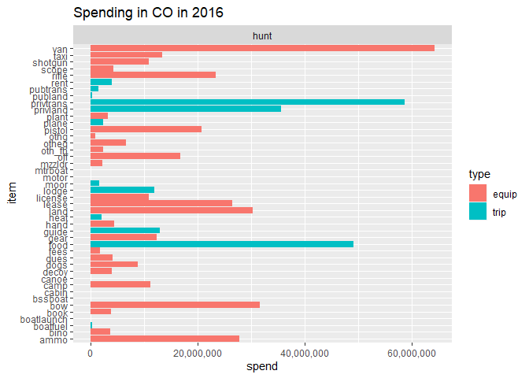
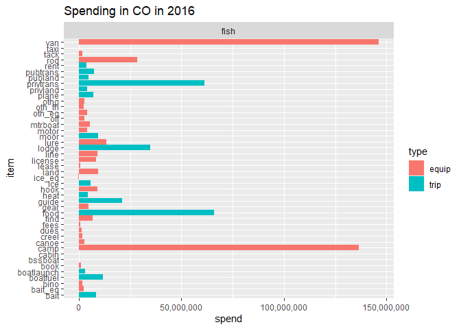
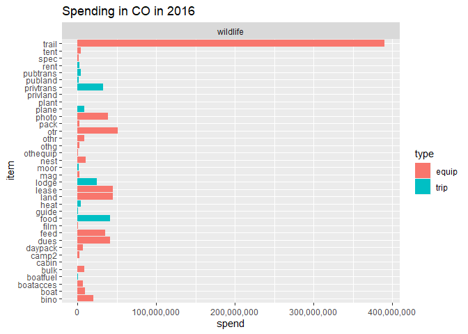

1-spend-usfws.R
================
danka
Sat Feb 08 11:13:59 2020

``` r
# spending for fishing/hunting/wildlife watching

library(tidyverse)
```

    ## -- Attaching packages --------------------------------------- tidyverse 1.2.1 --

    ## v ggplot2 3.0.0     v purrr   0.2.5
    ## v tibble  1.4.2     v dplyr   0.7.6
    ## v tidyr   0.8.1     v stringr 1.3.1
    ## v readr   1.1.1     v forcats 0.3.0

    ## -- Conflicts ------------------------------------------ tidyverse_conflicts() --
    ## x dplyr::filter() masks stats::filter()
    ## x dplyr::lag()    masks stats::lag()

``` r
library(readxl)
source("R/explore.R")
outfile <- "data/interim/usfws-spend2016.rds"

# Load Data ---------------------------------------------------------------

# OIA 2016 total spending in CO (for fish, hunt, wildlife watching)
# - based on National Survey (2011 I believe) compiled in 2016 by Tom
# - taken from O365 > Deliverables > OIA...State...xlsm [CO tab]
# - https://southwickassociatesinc.sharepoint.com/:x:/s/oia2016-001recreationeconreport/EVhBPXcPW59JjOhaG_AvtawBxgxHN-mR_8k0RpV82kJEJg?e=HR1U34
spend2016 <- tibble::tribble(
    ~act, ~spend,
    "fish", 660381823,
    "hunt", 530228764,
    "wildlife", 863281732
)
knitr::kable(spend2016, format.args = list(big.mark = ","))
```

| act      |       spend |
| :------- | ----------: |
| fish     | 660,381,823 |
| hunt     | 530,228,764 |
| wildlife | 863,281,732 |

``` r
# spending profiles (per day by item) for fish, hunt, wildlife watching
# - based on region 8 (mountain) pulled together by Tom in 2018
#   2016 Fish Hunt WW profiles.xlsx
spend_avg <- read_excel("data/raw/usfws-profiles-co.xlsx", sheet = "spend-profiles")

# Allocate by Item -----------------------------------------------------------

# use spending profiles to get % by item
spend_avg <- spend_avg %>%
    group_by(act) %>%
    mutate(pct = spend_per_day / sum(spend_per_day)) %>%
    ungroup()

# allocate totals by item
spend2016 <- spend_avg %>%
    full_join(spend2016, by = "act") %>%
    mutate(spend = spend * pct, year = 2016) %>%
    select(-spend_per_day, -pct)

# Save & Summarize -----------------------------------------------------------

saveRDS(spend2016, outfile)

for (i in c("hunt", "fish", "wildlife")) {
    filter(spend2016, act == i) %>% plot_spend() %>% print()
}
```

<!-- --><!-- --><!-- -->
