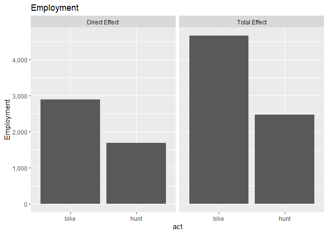
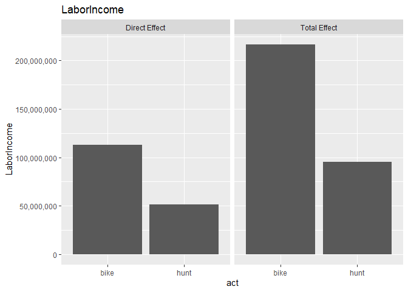
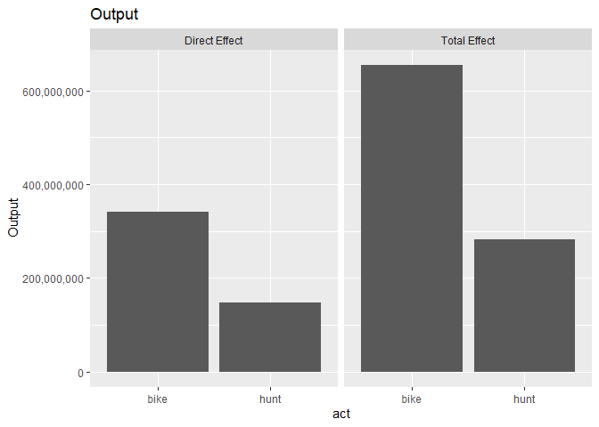
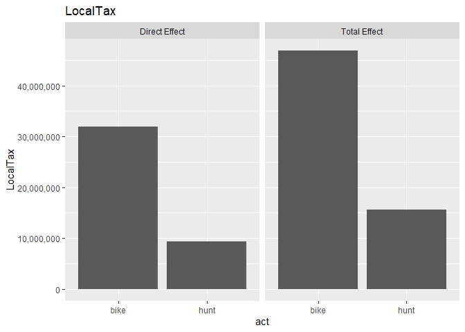

2-contributions.R
================
danka
2020-02-18

``` r
# Get contributions from Implan

library(tidyverse)
library(implan)
library(workflow) # xlsx_write_table()

indir <- "data/raw/implan_out"
outfile <- "data/processed/contributions.xlsx"

# load data
acts <- list.files(indir)
econ <- acts %>%
    sapply(function(x) {
        output_read_csv(file.path(indir, x)) %>% output_combine() %>%
            mutate(act = x)
    }, simplify = FALSE) %>%
    bind_rows()

# save
xlsx_write_table(econ, outfile)

# summarize
plot_metric <- function(df, metric) {
    df %>%
        filter(ImpactType %in% c("Direct Effect", "Total Effect")) %>%
        ggplot(aes_string("act", metric)) +
        geom_col() +
        facet_wrap(~ ImpactType) +
        ggtitle(metric) +
        scale_y_continuous(labels = scales::comma)
}
plot_metric(econ, "Employment")
```

<!-- -->

``` r
plot_metric(econ, "LaborIncome")
```

<!-- -->

``` r
plot_metric(econ, "TotalValueAdded")
```

<!-- -->

``` r
plot_metric(econ, "Output")
```

<!-- -->

``` r
plot_metric(econ, "FedTax")
```

<!-- -->

``` r
plot_metric(econ, "LocalTax")
```

<!-- -->
