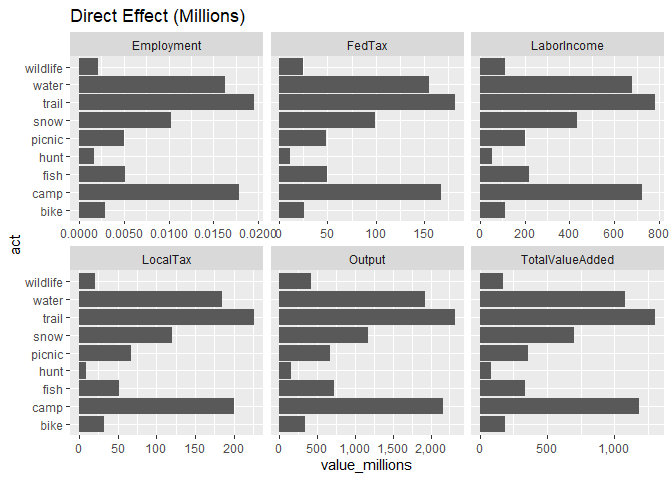
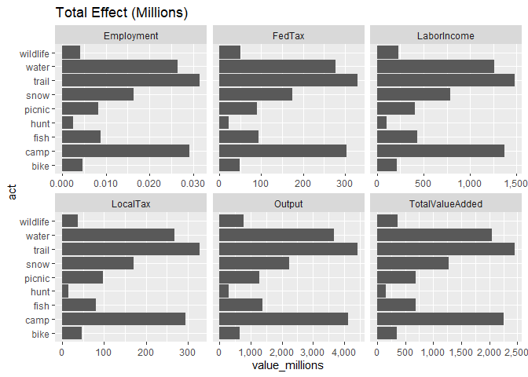

2-contributions.R
================
danka
2020-02-20

``` r
# Get contributions from Implan

library(tidyverse)
```

    ## -- Attaching packages --------------------------------------- tidyverse 1.3.0 --

    ## v ggplot2 3.2.1     v purrr   0.3.3
    ## v tibble  2.1.3     v dplyr   0.8.4
    ## v tidyr   1.0.2     v stringr 1.4.0
    ## v readr   1.3.1     v forcats 0.4.0

    ## -- Conflicts ------------------------------------------ tidyverse_conflicts() --
    ## x dplyr::filter() masks stats::filter()
    ## x dplyr::lag()    masks stats::lag()

``` r
library(implan)
library(workflow) # xlsx_write_table()

indir <- "data/raw/implan_out"
outfile <- "out/contributions.xlsx"

# load data
acts <- list.files(indir)
econ <- sapply(acts, function(x) { 
    output_read_csv(file.path(indir, x)) %>% output_combine() %>% mutate(act = x) 
}, simplify = FALSE) %>%
    bind_rows()

# get total (all activities)
econ_total <- econ %>%
    select(-act) %>%
    group_by(ImpactType) %>%
    summarise_all("sum")

# save
xlsx_write_table(econ, outfile)
xlsx_write_table(econ_total, outfile)

# summarize
plot_impact <- function(econ, impact_type) {
    econ %>%
        gather(metric, value, Employment:LocalTax) %>%
        mutate(value_millions = value / 10^6) %>%
        filter(ImpactType == impact_type) %>%
        ggplot(aes(act, value_millions)) +
        geom_col() +
        facet_wrap(~ metric, scales = "free_x") +
        ggtitle(paste(impact_type, "(Millions)")) +
        scale_y_continuous(labels = scales::comma) +
        coord_flip()
}
plot_impact(econ, "Direct Effect")
```

<!-- -->

``` r
plot_impact(econ, "Total Effect")
```

<!-- -->
