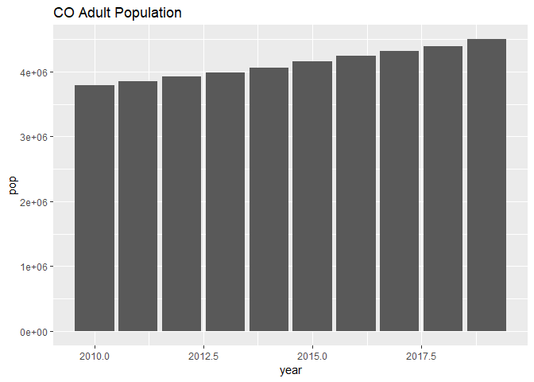

2-year-adjust.R
================
danka
Thu Feb 06 15:45:07 2020

``` r
# get population and CPI for adjusting spending to 2019

library(tidyverse)
```

    ## -- Attaching packages --------------------------------------- tidyverse 1.2.1 --

    ## v ggplot2 3.0.0     v purrr   0.2.5
    ## v tibble  1.4.2     v dplyr   0.7.6
    ## v tidyr   0.8.1     v stringr 1.3.1
    ## v readr   1.1.1     v forcats 0.3.0

    ## -- Conflicts ------------------------------------------ tidyverse_conflicts() --
    ## x dplyr::filter() masks stats::filter()
    ## x dplyr::lag()    masks stats::lag()

``` r
library(readxl)
source("R/results.R")

# Population --------------------------------------------------------------

# CO adult population in 2019 
pop19 <- read_excel(
    "data/census/SCPRC-EST2019-18+POP-RES.xlsx",  
    col_names = c("state", "total", "adult", "adult_pct"), skip = 9
) %>%
    filter(state == ".Colorado") %>%
    mutate(year = 2019) %>%
    select(year, pop = adult)

# CO adult population 2010-2018
# - codebook: data/census/sc-est...pdf
pop10 <- read_csv("data/census/sc-est2018-agesex-civ.csv") %>%
    filter(AGE >= 18, NAME == "Colorado", SEX == 0, AGE != 999) %>%
    select(AGE, POPEST2010_CIV:POPEST2018_CIV) %>%
    gather(year, pop, -AGE) %>%
    mutate(year = str_remove(year, "POPEST") %>% str_remove("_CIV") %>% as.numeric()) %>%
    group_by(year) %>%
    summarise(pop = sum(pop))
```

    ## Parsed with column specification:
    ## cols(
    ##   SUMLEV = col_character(),
    ##   REGION = col_integer(),
    ##   DIVISION = col_integer(),
    ##   STATE = col_integer(),
    ##   NAME = col_character(),
    ##   SEX = col_integer(),
    ##   AGE = col_integer(),
    ##   ESTBASE2010_CIV = col_integer(),
    ##   POPEST2010_CIV = col_integer(),
    ##   POPEST2011_CIV = col_integer(),
    ##   POPEST2012_CIV = col_integer(),
    ##   POPEST2013_CIV = col_integer(),
    ##   POPEST2014_CIV = col_integer(),
    ##   POPEST2015_CIV = col_integer(),
    ##   POPEST2016_CIV = col_integer(),
    ##   POPEST2017_CIV = col_integer(),
    ##   POPEST2018_CIV = col_integer()
    ## )

``` r
# combine
pop <- bind_rows(pop10, pop19)
ggplot(pop, aes(year, pop)) + geom_col() + ggtitle("CO Adult Population")
```

<!-- -->

``` r
# CPI ---------------------------------------------------------------------
# https://www.minneapolisfed.org/about-us/monetary-policy/inflation-calculator/consumer-price-index-1913-

cpi <- tibble::tribble(
    ~year, ~cpi,
    2016, 240.0,
    2017, 245.1,
    2018, 251.1,
    2019, 255.7
)
ggplot(cpi, aes(year, cpi)) + geom_col() + ggtitle("US CPI in recent years")
```

<!-- -->

``` r
# Save --------------------------------------------------------------------

outfile <- "out/profiles.xlsx"
write_table(pop, "pop", outfile)
write_table(cpi, "cpi", outfile)
```
