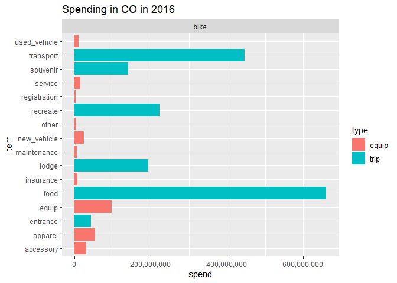
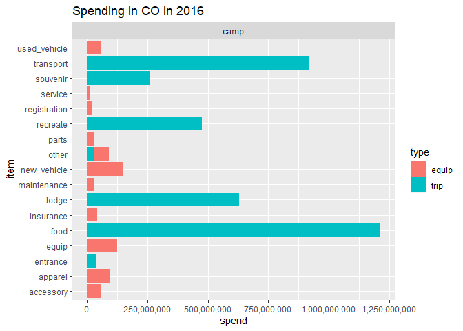
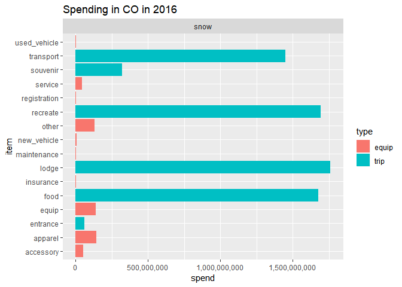
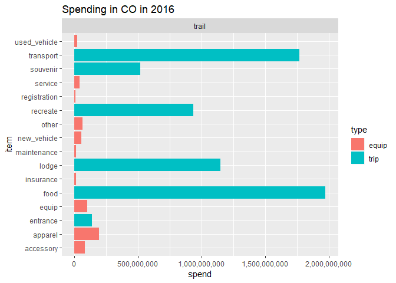
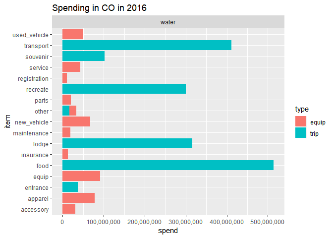

2-spend-oia.R
================
danka
Sat Feb 08 10:44:50 2020

``` r
# get OIA spending by item in CO

library(tidyverse)
library(readxl)
source("R/explore.R")
outfile <- "data/interim/oia-spend2016.rds"

# Load Data ---------------------------------------------------------------

# 2016 OIA total spending
load("data/raw/oia/results.RDATA") # 3 lists: tot, stat, out

# relation table: to restrict to just those act1 activities targeted for colorado
acts <- read_excel("data/raw/oia/oia-activities.xlsx", sheet = "co-oia-acts") %>%
    filter(!is.na(co_activity))

# vehicle relation table: an additional step is needed for vehicle spending
vehicle_acts <- read_excel("data/raw/oia/Vehicle_act1.xlsx", sheet = "vehicle_act1") %>%
    select(act_vehicle_all, act1)

# Spending by CO activity -------------------------------------------------
# - get spending by item for each CO svy activity

# each spending table will be filtered
filter_spend <- function(df) {
    df %>%
        filter(state == "Colorado") %>%
        right_join(acts, by = "act1")
} 

# summarize spending for the 3 types
trip <- tot$trip_spend %>% 
    filter_spend() %>%
    group_by(co_activity, item) %>%
    summarise(spend = sum(trip_spend_tot)) %>%
    ungroup() %>%
    mutate(type = "trip")

equip <- tot$equip_all %>%
    filter_spend() %>%
    group_by(co_activity, item) %>%
    summarise(spend = sum(equip_spend_tot)) %>%
    ungroup() %>%
    mutate(type = "equip")

# - vehicle requires an additional translation step
x <- tot$vehicle_spend %>%
    mutate(item = ifelse(age == "new", "new_vehicle", "used_vehicle")) %>%
    left_join(vehicle_acts, by = "act_vehicle_all")

vehicle <- x %>%
    filter_spend() %>%
    group_by(co_activity, item) %>%
    summarise(spend = sum(tot_spend)) %>%
    ungroup() %>%
    mutate(type = "equip")

# Save & Summarize ---------------------------------------------------------

spend <- bind_rows(trip, equip, vehicle) %>%
    rename(act = co_activity) %>%
    mutate(year = 2016)
saveRDS(spend, outfile)

# these will mostly match the categories reported in OIA 2016 for Colorado
# - snow will be a bit smaller since it excludes snowmobile
# - https://southwickassociatesinc.sharepoint.com/:x:/s/oia2016-001recreationeconreport/EVhBPXcPW59JjOhaG_AvtawBxgxHN-mR_8k0RpV82kJEJg?e=aabTqo
spend %>%
    group_by(act) %>%
    summarise(sum(spend)) %>%
    knitr::kable(format.args = list(big.mark = ","))
```

| act   |    sum(spend) |
| :---- | ------------: |
| bike  | 1,957,056,509 |
| camp  | 4,244,549,771 |
| snow  | 7,491,859,198 |
| trail | 7,078,021,722 |
| water | 2,137,155,597 |

``` r
for (i in unique(spend$act)) {
    filter(spend, act == i) %>% plot_spend() %>% print()
}
```

<!-- --><!-- --><!-- --><!-- --><!-- -->
