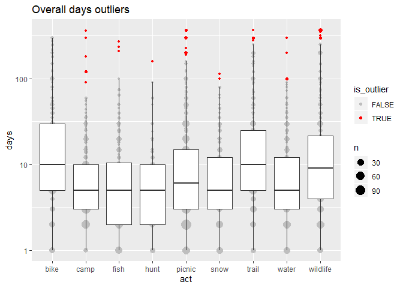

7-recode-outliers.R
================
danka
2020-02-20

``` r
# identify days outliers using tukey's rule
# also filtering out respondents flagged for suspicion

library(tidyverse)
library(sastats)

source("R/prep-svy.R") # write_list_csv()

outfile <- "data/processed/svy.rds"
outfile_csv <- "data/processed/svy-csv"
svy <- readRDS("data/interim/svy-weight.rds")

# exclude suspicious respondents
suspicious <- filter(svy$person, flag > 3)
svy <- lapply(svy, function(df) anti_join(df, suspicious, by = "Vrid"))
```

    ## Warning: Column `Vrid` has different attributes on LHS and RHS of join
    
    ## Warning: Column `Vrid` has different attributes on LHS and RHS of join

``` r
# Overall Days ------------------------------------------------------------

# identify outliers & set to NA
svy$act <- svy$act %>%
    group_by(act) %>%
    mutate(
        is_outlier = outlier_tukey(days, apply_log = TRUE),
        days_cleaned = ifelse(is_outlier, NA, days)
    ) %>%
    ungroup()

# summarize
x <- filter(svy$act, is_targeted)
outlier_plot(x, days, act, apply_log = TRUE, show_outliers = TRUE) + 
    ggtitle("Overall days outliers")
```

<!-- -->

``` r
outlier_pct(x, act) %>% knitr::kable()
```

| act      | is\_outlier |  n | pct\_outliers |
| :------- | :---------- | -: | ------------: |
| camp     | TRUE        |  6 |     0.4792332 |
| fish     | TRUE        |  3 |     0.2396166 |
| hunt     | TRUE        |  1 |     0.0798722 |
| picnic   | TRUE        | 15 |     1.1980831 |
| snow     | TRUE        |  2 |     0.1597444 |
| trail    | TRUE        |  4 |     0.3194888 |
| water    | TRUE        |  4 |     0.3194888 |
| wildlife | TRUE        | 13 |     1.0383387 |

``` r
outlier_mean_compare(x, days, days_cleaned, act) %>% knitr::kable()
```

| act      |      days | days\_cleaned |
| :------- | --------: | ------------: |
| bike     | 31.581395 |     31.581395 |
| camp     | 11.163218 |      8.582751 |
| fish     | 11.640523 |      9.396040 |
| hunt     |  9.374150 |      8.342466 |
| picnic   | 17.478161 |     13.095906 |
| snow     |  9.989247 |      9.292419 |
| trail    | 28.418367 |     25.502577 |
| water    | 12.353760 |     10.521127 |
| wildlife | 30.524490 |     21.828092 |

``` r
# clean-up
svy$act <- svy$act %>%
    select(-days) %>%
    rename(days = days_cleaned, is_overall_outlier = is_outlier)

# Water Days --------------------------------------------------------------

# run outlier test specific to water days
# also any records with corresponding overall outliers will have water days set to missing
svy$act <- svy$act %>%
    group_by(act) %>%
    mutate(
        is_outlier = outlier_tukey(days_water, apply_log = TRUE),
        days_cleaned = ifelse(is_outlier | is_overall_outlier, NA, days_water)
    ) %>%
    ungroup()

# summarize
x <- filter(svy$act, is_targeted)
outlier_plot(x, days_water, act, apply_log = TRUE, show_outliers = TRUE) + 
    ggtitle("Water days outliers")
```

<!-- -->

``` r
outlier_pct(x, act) %>% knitr::kable()
```

| act      | is\_outlier | n | pct\_outliers |
| :------- | :---------- | -: | ------------: |
| bike     | TRUE        | 4 |     0.3194888 |
| camp     | TRUE        | 5 |     0.3993610 |
| fish     | TRUE        | 3 |     0.2396166 |
| picnic   | TRUE        | 7 |     0.5591054 |
| trail    | TRUE        | 4 |     0.3194888 |
| water    | TRUE        | 3 |     0.2396166 |
| wildlife | TRUE        | 4 |     0.3194888 |

``` r
outlier_mean_compare(x, days_water, days_cleaned, act) %>% knitr::kable()
```

| act      | days\_water | days\_cleaned |
| :------- | ----------: | ------------: |
| bike     |   15.344633 |     10.670520 |
| camp     |    7.904153 |      5.771987 |
| fish     |   11.776667 |      9.488216 |
| hunt     |    5.846154 |      5.607843 |
| picnic   |   10.650741 |      7.627090 |
| snow     |    2.929578 |      2.929578 |
| trail    |   14.873188 |     11.033210 |
| water    |   11.731013 |      9.926518 |
| wildlife |   13.019943 |     11.043732 |

``` r
# clean-up
svy$act <- svy$act %>%
    select(Vrid:part, days, part_water, days_water = days_cleaned)

# Basin Water Days --------------------------------------------------------

# outliers are identified specific to act-basin
# use top-coding for these to avoid losing information about the share of 
#  days allocated to each basin
svy$basin <- svy$basin %>%
    group_by(act, basin) %>%
    mutate(
        is_outlier = outlier_tukey(days_water, apply_log = TRUE),
        topcode_value = outlier_tukey_top(days_water, apply_log = TRUE),
        days_cleaned = ifelse(is_outlier, topcode_value, days_water)
    ) %>%
    ungroup()

# summarize
x <- filter(svy$basin)
plts <- sapply(unique(x$basin), function(i) {
    tmp <- filter(x, basin == i)
    outlier_plot(tmp, days_water, act, apply_log = TRUE, show_outliers = TRUE) + 
        ggtitle(i) + theme(legend.position = "none")
}, simplify = FALSE)
cowplot::plot_grid(plotlist = plts)
```

<!-- -->

``` r
outlier_pct(x, act, basin) %>% ungroup() %>% select(-n, -is_outlier) %>% 
    spread(basin, pct_outliers, fill = 0) %>% knitr::kable()
```

| act      |  arkansas |  colorado |  gunnison |     metro |  n platte |       rio |  s platte | southwest |     yampa |
| :------- | --------: | --------: | --------: | --------: | --------: | --------: | --------: | --------: | --------: |
| bike     | 0.0000000 | 0.0000000 | 0.0000000 | 0.0000000 | 0.0000000 | 0.5714286 | 1.7142857 | 0.5714286 | 0.0000000 |
| camp     | 0.6153846 | 0.9230769 | 0.3076923 | 0.3076923 | 0.6153846 | 0.0000000 | 1.2307692 | 0.6153846 | 0.0000000 |
| fish     | 0.3571429 | 0.3571429 | 0.3571429 | 0.3571429 | 0.3571429 | 0.0000000 | 0.3571429 | 0.0000000 | 0.0000000 |
| hunt     | 0.0000000 | 0.0000000 | 0.0000000 | 0.0000000 | 0.0000000 | 0.0000000 | 0.0000000 | 4.2553191 | 0.0000000 |
| picnic   | 0.3284072 | 0.3284072 | 0.0000000 | 0.3284072 | 0.3284072 | 0.3284072 | 0.6568144 | 0.0000000 | 0.0000000 |
| snow     | 0.0000000 | 0.0000000 | 0.0000000 | 1.7241379 | 0.0000000 | 3.4482759 | 0.0000000 | 1.7241379 | 1.7241379 |
| trail    | 0.0000000 | 0.3496503 | 0.0000000 | 0.3496503 | 0.3496503 | 0.3496503 | 0.0000000 | 0.3496503 | 0.6993007 |
| water    | 0.2967359 | 0.5934718 | 0.0000000 | 0.0000000 | 0.0000000 | 0.5934718 | 0.0000000 | 0.0000000 | 0.0000000 |
| wildlife | 0.0000000 | 0.2890173 | 0.0000000 | 0.0000000 | 0.2890173 | 0.0000000 | 1.7341040 | 0.0000000 | 0.0000000 |

``` r
outlier_mean_compare(x, days_water, days_cleaned, act, basin) %>%
    knitr::kable()
```

| act      | basin     | days\_water | days\_cleaned |
| :------- | :-------- | ----------: | ------------: |
| bike     | arkansas  |   23.714286 |     23.714286 |
| bike     | colorado  |    9.523810 |      9.523810 |
| bike     | gunnison  |         NaN |           NaN |
| bike     | metro     |    9.538462 |      9.538462 |
| bike     | n platte  |    3.500000 |      3.500000 |
| bike     | rio       |    5.000000 |      5.000000 |
| bike     | s platte  |   21.250000 |     11.366720 |
| bike     | southwest |   15.400000 |      6.352847 |
| bike     | yampa     |    8.333333 |      8.333333 |
| camp     | arkansas  |    4.171875 |      4.148882 |
| camp     | colorado  |    3.653061 |      3.387966 |
| camp     | gunnison  |    4.816326 |      4.607433 |
| camp     | metro     |    4.375000 |      2.524519 |
| camp     | n platte  |   18.310345 |      5.798406 |
| camp     | rio       |    3.269231 |      3.269231 |
| camp     | s platte  |    5.486111 |      4.361902 |
| camp     | southwest |   10.411765 |      3.978083 |
| camp     | yampa     |    3.681818 |      3.681818 |
| fish     | arkansas  |    9.524590 |      7.205865 |
| fish     | colorado  |    6.716418 |      6.654258 |
| fish     | gunnison  |    5.108108 |      4.697922 |
| fish     | metro     |    8.096774 |      5.381784 |
| fish     | n platte  |    3.428571 |      2.939775 |
| fish     | rio       |         NaN |           NaN |
| fish     | s platte  |    6.723077 |      5.889774 |
| fish     | southwest |    6.250000 |      6.250000 |
| fish     | yampa     |    6.058823 |      6.058823 |
| hunt     | arkansas  |    9.833333 |      9.833333 |
| hunt     | colorado  |    5.000000 |      5.000000 |
| hunt     | gunnison  |    3.250000 |      3.250000 |
| hunt     | metro     |         NaN |           NaN |
| hunt     | n platte  |    1.666667 |      1.666667 |
| hunt     | rio       |    6.750000 |      6.750000 |
| hunt     | s platte  |    5.111111 |      5.111111 |
| hunt     | southwest |    1.333333 |      1.333333 |
| hunt     | yampa     |    7.500000 |      7.500000 |
| picnic   | arkansas  |    6.200000 |      5.530489 |
| picnic   | colorado  |    6.838235 |      5.880907 |
| picnic   | gunnison  |    2.978723 |      2.978723 |
| picnic   | metro     |   13.153846 |     12.764211 |
| picnic   | n platte  |   10.204082 |      4.644688 |
| picnic   | rio       |    4.346154 |      3.293362 |
| picnic   | s platte  |    7.491018 |      5.333579 |
| picnic   | southwest |    4.965517 |      4.965517 |
| picnic   | yampa     |    2.666667 |      2.666667 |
| snow     | arkansas  |    2.833333 |      2.833333 |
| snow     | colorado  |    2.291667 |      2.291667 |
| snow     | gunnison  |    2.750000 |      2.750000 |
| snow     | metro     |    1.500000 |      1.500000 |
| snow     | n platte  |    2.250000 |      2.250000 |
| snow     | rio       |    1.000000 |      1.000000 |
| snow     | s platte  |         NaN |           NaN |
| snow     | southwest |    1.600000 |      1.146873 |
| snow     | yampa     |    5.000000 |      5.000000 |
| trail    | arkansas  |    6.745455 |      6.745455 |
| trail    | colorado  |    4.905263 |      4.862123 |
| trail    | gunnison  |    3.866667 |      3.866667 |
| trail    | metro     |   14.763158 |     13.108629 |
| trail    | n platte  |   15.593750 |      5.619853 |
| trail    | rio       |    2.684210 |      2.675557 |
| trail    | s platte  |    6.569767 |      6.569767 |
| trail    | southwest |    4.285714 |      4.036392 |
| trail    | yampa     |    2.000000 |      1.633603 |
| water    | arkansas  |    4.977273 |      4.949187 |
| water    | colorado  |    6.783132 |      6.162587 |
| water    | gunnison  |    3.437500 |      3.437500 |
| water    | metro     |    9.370370 |      9.370370 |
| water    | n platte  |    4.500000 |      4.500000 |
| water    | rio       |    4.166667 |      3.383542 |
| water    | s platte  |    7.312500 |      7.312500 |
| water    | southwest |    8.600000 |      8.600000 |
| water    | yampa     |    3.000000 |      3.000000 |
| wildlife | arkansas  |    5.953125 |      5.953125 |
| wildlife | colorado  |    6.458824 |      5.351785 |
| wildlife | gunnison  |    3.534884 |      3.534884 |
| wildlife | metro     |   10.103896 |     10.103896 |
| wildlife | n platte  |    8.303030 |      5.451567 |
| wildlife | rio       |    3.550000 |      3.550000 |
| wildlife | s platte  |    9.229358 |      6.697812 |
| wildlife | southwest |    5.000000 |      5.000000 |
| wildlife | yampa     |    2.200000 |      2.200000 |

``` r
# clean-up
svy$basin <- svy$basin %>%
    select(Vrid:part_water, days_water = days_cleaned)

# Save --------------------------------------------------------------------

saveRDS(svy, outfile)

# save as csvs (for Eric)
sapply(names(svy), function(nm) {
    write_list_csv(svy, nm, outfile_csv)
})
```

    ## $person
    ## # A tibble: 1,252 x 12
    ##    Vrid  id    Vstatus sex   race  race_other hispanic age_weight income_weight
    ##    <chr> <chr> <chr>   <chr> <chr> <chr>      <chr>    <chr>      <chr>        
    ##  1 98    C205~ Comple~ Fema~ White ""         No       35-54      0-25K        
    ##  2 99    C205~ Comple~ Fema~ Other "unecessa~ No       35-54      0-25K        
    ##  3 100   C205~ Partial <NA>  <NA>  ""         <NA>     <NA>       <NA>         
    ##  4 101   C205~ Comple~ Male  White ""         No       35-54      25-35K       
    ##  5 102   C205~ Comple~ Fema~ Blac~ ""         No       35-54      50-75K       
    ##  6 103   C205~ Comple~ Male  White ""         No       18-34      25-35K       
    ##  7 105   C205~ Comple~ Male  White ""         No       18-34      50-75K       
    ##  8 106   C205~ Comple~ Fema~ Blac~ ""         No       35-54      35-50K       
    ##  9 107   C205~ Comple~ Male  White ""         Yes      35-54      25-35K       
    ## 10 108   C205~ Comple~ Fema~ Asian ""         Yes      18-34      100-150K     
    ## # ... with 1,242 more rows, and 3 more variables: race_weight <chr>, flag <dbl>,
    ## #   weight <dbl>
    ## 
    ## $act
    ## # A tibble: 17,528 x 7
    ##    Vrid  act   is_targeted part       days part_water days_water
    ##    <chr> <chr> <lgl>       <chr>     <dbl> <chr>           <dbl>
    ##  1 98    trail TRUE        Unchecked    NA <NA>               NA
    ##  2 99    trail TRUE        Unchecked    NA <NA>               NA
    ##  3 100   trail TRUE        Unchecked    NA <NA>               NA
    ##  4 101   trail TRUE        Unchecked    NA <NA>               NA
    ##  5 102   trail TRUE        Unchecked    NA <NA>               NA
    ##  6 103   trail TRUE        Unchecked    NA <NA>               NA
    ##  7 105   trail TRUE        Unchecked    NA <NA>               NA
    ##  8 106   trail TRUE        Unchecked    NA <NA>               NA
    ##  9 107   trail TRUE        Checked      15 Yes                10
    ## 10 108   trail TRUE        Checked      10 Yes                 5
    ## # ... with 17,518 more rows
    ## 
    ## $basin
    ## # A tibble: 22,167 x 5
    ##    Vrid  act   basin    part_water days_water
    ##    <chr> <chr> <chr>    <chr>           <dbl>
    ##  1 107   trail arkansas Checked             5
    ##  2 108   trail arkansas Unchecked          NA
    ##  3 110   trail arkansas Unchecked          NA
    ##  4 113   trail arkansas Checked             8
    ##  5 119   trail arkansas Unchecked          NA
    ##  6 129   trail arkansas Checked             1
    ##  7 131   trail arkansas Unchecked          NA
    ##  8 140   trail arkansas Checked            12
    ##  9 157   trail arkansas Unchecked          NA
    ## 10 159   trail arkansas Unchecked          NA
    ## # ... with 22,157 more rows
