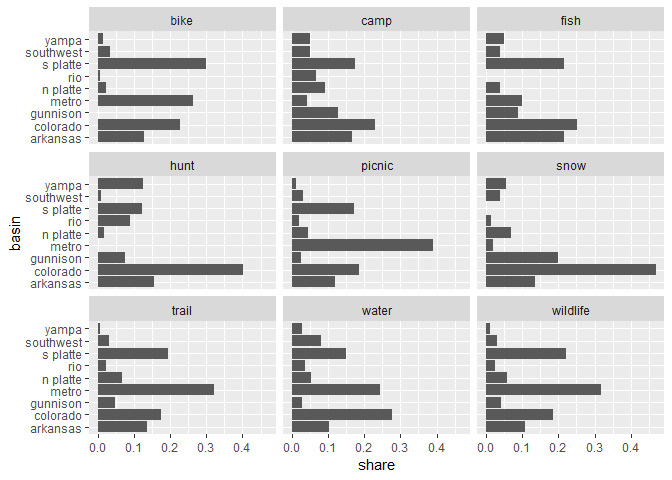

Getting basin share of days
================
February 07, 2020

``` r
library(tidyverse)
svy <- readRDS("../data-work/1-svy/svy-final.rds")
svy$basin <- svy$basin %>%
    left_join(select(svy$person, Vrid, weight))
```

## Calculate Share

``` r
share <- svy$basin %>%
    filter(!is.na(days_water), days_water != 0) %>%
    group_by(act, basin) %>%
    summarise(days_water = weighted.mean(days_water, weight), n = n()) %>%
    mutate(share = days_water / sum(days_water))
```

## Plot

``` r
share %>%
    ggplot(aes(basin, share)) +
    geom_col() +
    coord_flip() +
    facet_wrap(~ act)
```

<!-- -->

## Sample Size

``` r
summarise(share, samp_size = sum(n)) %>% knitr::kable()
```

| act      | samp\_size |
| :------- | ---------: |
| bike     |        172 |
| camp     |        381 |
| fish     |        308 |
| hunt     |         44 |
| picnic   |        679 |
| snow     |         46 |
| trail    |        398 |
| water    |        304 |
| wildlife |        452 |

## Profile Table

``` r
knitr::kable(share)
```

| act      | basin     | days\_water |   n |     share |
| :------- | :-------- | ----------: | --: | --------: |
| bike     | arkansas  |   16.013977 |  14 | 0.2165975 |
| bike     | colorado  |    9.831774 |  38 | 0.1329799 |
| bike     | metro     |    8.789424 |  52 | 0.1188816 |
| bike     | n platte  |    3.670764 |  11 | 0.0496490 |
| bike     | rio       |   10.000000 |   1 | 0.1352553 |
| bike     | s platte  |   10.391827 |  48 | 0.1405549 |
| bike     | southwest |    7.440670 |   5 | 0.1006390 |
| bike     | yampa     |    7.795847 |   3 | 0.1054429 |
| camp     | arkansas  |    4.323798 |  61 | 0.1168166 |
| camp     | colorado  |    3.669169 |  92 | 0.0991304 |
| camp     | gunnison  |    4.641493 |  49 | 0.1253998 |
| camp     | metro     |    2.931139 |  20 | 0.0791910 |
| camp     | n platte  |    6.406227 |  27 | 0.1730779 |
| camp     | rio       |    3.440342 |  25 | 0.0929482 |
| camp     | s platte  |    4.188908 |  69 | 0.1131723 |
| camp     | southwest |    3.597351 |  17 | 0.0971901 |
| camp     | yampa     |    3.815120 |  21 | 0.1030736 |
| fish     | arkansas  |    6.798706 |  58 | 0.1517911 |
| fish     | colorado  |    6.459646 |  67 | 0.1442211 |
| fish     | gunnison  |    4.745831 |  35 | 0.1059576 |
| fish     | metro     |    5.619060 |  29 | 0.1254538 |
| fish     | n platte  |    2.977132 |  26 | 0.0664689 |
| fish     | s platte  |    5.782456 |  65 | 0.1291018 |
| fish     | southwest |    6.701229 |  11 | 0.1496148 |
| fish     | yampa     |    5.705827 |  17 | 0.1273910 |
| hunt     | arkansas  |    8.926077 |   6 | 0.1957271 |
| hunt     | colorado  |    4.932258 |  16 | 0.1081524 |
| hunt     | gunnison  |    4.788376 |   3 | 0.1049974 |
| hunt     | n platte  |    2.576852 |   2 | 0.0565041 |
| hunt     | rio       |    6.572352 |   4 | 0.1441156 |
| hunt     | s platte  |    5.583144 |   8 | 0.1224247 |
| hunt     | southwest |    2.000000 |   2 | 0.0438551 |
| hunt     | yampa     |   10.225649 |   3 | 0.2242235 |
| picnic   | arkansas  |    5.850518 | 106 | 0.1106132 |
| picnic   | colorado  |    5.839133 | 134 | 0.1103980 |
| picnic   | gunnison  |    3.071622 |  46 | 0.0580738 |
| picnic   | metro     |   16.096567 | 111 | 0.3043309 |
| picnic   | n platte  |    4.694849 |  47 | 0.0887635 |
| picnic   | rio       |    3.555284 |  24 | 0.0672182 |
| picnic   | s platte  |    5.459456 | 159 | 0.1032196 |
| picnic   | southwest |    5.821935 |  26 | 0.1100728 |
| picnic   | yampa     |    2.502301 |  26 | 0.0473099 |
| snow     | arkansas  |    2.463418 |   6 | 0.1161661 |
| snow     | colorado  |    2.488302 |  21 | 0.1173395 |
| snow     | gunnison  |    2.549193 |   8 | 0.1202110 |
| snow     | metro     |    3.000000 |   1 | 0.1414694 |
| snow     | n platte  |    3.239405 |   3 | 0.1527589 |
| snow     | rio       |    1.000000 |   2 | 0.0471565 |
| snow     | southwest |    1.465678 |   4 | 0.0691162 |
| snow     | yampa     |    5.000000 |   1 | 0.2357824 |
| trail    | arkansas  |    6.711862 |  53 | 0.1366527 |
| trail    | colorado  |    4.838639 |  90 | 0.0985141 |
| trail    | gunnison  |    4.020372 |  29 | 0.0818543 |
| trail    | metro     |   12.310377 |  71 | 0.2506378 |
| trail    | n platte  |    5.623638 |  29 | 0.1144966 |
| trail    | rio       |    2.964712 |  16 | 0.0603612 |
| trail    | s platte  |    6.403968 |  81 | 0.1303840 |
| trail    | southwest |    4.644889 |  19 | 0.0945694 |
| trail    | yampa     |    1.597743 |  10 | 0.0325299 |
| water    | arkansas  |    5.112240 |  43 | 0.0956676 |
| water    | colorado  |    6.452814 |  79 | 0.1207543 |
| water    | gunnison  |    3.675441 |  15 | 0.0687801 |
| water    | metro     |    9.612453 |  50 | 0.1798820 |
| water    | n platte  |    4.962827 |  23 | 0.0928716 |
| water    | rio       |    3.170572 |  18 | 0.0593323 |
| water    | s platte  |    7.334839 |  46 | 0.1372601 |
| water    | southwest |    9.931577 |  15 | 0.1858539 |
| water    | yampa     |    3.184774 |  15 | 0.0595981 |
| wildlife | arkansas  |    5.264489 |  64 | 0.1062106 |
| wildlife | colorado  |    5.517900 |  82 | 0.1113231 |
| wildlife | gunnison  |    3.165587 |  42 | 0.0638654 |
| wildlife | metro     |   12.389398 |  71 | 0.2499550 |
| wildlife | n platte  |    5.249447 |  33 | 0.1059071 |
| wildlife | rio       |    3.435960 |  20 | 0.0693202 |
| wildlife | s platte  |    6.944070 | 102 | 0.1400960 |
| wildlife | southwest |    5.327355 |  19 | 0.1074789 |
| wildlife | yampa     |    2.272308 |  19 | 0.0458436 |
