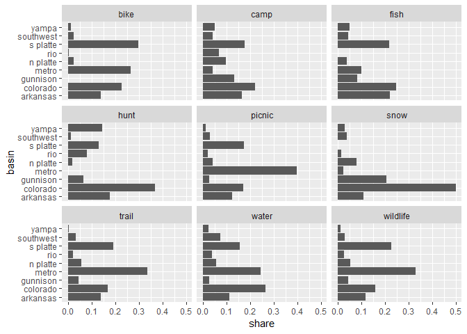

Getting basin share of days
================
February 07, 2020

``` r
library(tidyverse)
svy <- readRDS("../data-work/1-svy/svy-final.rds")
svy$basin <- svy$basin %>%
    left_join(select(svy$person, Vrid, weight))
```

## Calculate Share

``` r
share <- svy$basin %>%
    filter(!is.na(days_water), days_water != 0) %>%
    group_by(act, basin) %>%
    summarise(days_water = sum(days_water * weight), n = n()) %>%
    mutate(share = days_water / sum(days_water))
```

## Plot

``` r
share %>%
    ggplot(aes(basin, share)) +
    geom_col() +
    coord_flip() +
    facet_wrap(~ act)
```

<!-- -->

## Check - sum & sample size

``` r
summarise(share, samp_size = sum(n), sum(share)) %>% knitr::kable()
```

| act      | samp\_size | sum(share) |
| :------- | ---------: | ---------: |
| bike     |        172 |          1 |
| camp     |        381 |          1 |
| fish     |        308 |          1 |
| hunt     |         44 |          1 |
| picnic   |        679 |          1 |
| snow     |         46 |          1 |
| trail    |        398 |          1 |
| water    |        304 |          1 |
| wildlife |        452 |          1 |

## Profile Table

``` r
knitr::kable(share)
```

| act      | basin     | days\_water |   n |     share |
| :------- | :-------- | ----------: | --: | --------: |
| bike     | arkansas  |  236.751289 |  14 | 0.1404869 |
| bike     | colorado  |  385.429592 |  38 | 0.2287118 |
| bike     | metro     |  445.012266 |  52 | 0.2640678 |
| bike     | n platte  |   41.456005 |  11 | 0.0245998 |
| bike     | rio       |    8.374250 |   1 | 0.0049692 |
| bike     | s platte  |  503.202623 |  48 | 0.2985976 |
| bike     | southwest |   41.795188 |   5 | 0.0248010 |
| bike     | yampa     |   23.198522 |   3 | 0.0137659 |
| camp     | arkansas  |  259.292605 |  61 | 0.1648785 |
| camp     | colorado  |  349.418858 |  92 | 0.2221878 |
| camp     | gunnison  |  210.442845 |  49 | 0.1338160 |
| camp     | metro     |   64.876918 |  20 | 0.0412538 |
| camp     | n platte  |  153.276071 |  27 | 0.0974649 |
| camp     | rio       |  108.044101 |  25 | 0.0687029 |
| camp     | s platte  |  278.640775 |  69 | 0.1771816 |
| camp     | southwest |   68.321700 |  17 | 0.0434443 |
| camp     | yampa     |   80.314580 |  21 | 0.0510703 |
| fish     | arkansas  |  403.294214 |  58 | 0.2193040 |
| fish     | colorado  |  455.354397 |  67 | 0.2476134 |
| fish     | gunnison  |  151.751655 |  35 | 0.0825198 |
| fish     | metro     |  185.065429 |  29 | 0.1006352 |
| fish     | n platte  |   72.195039 |  26 | 0.0392583 |
| fish     | s platte  |  398.498042 |  65 | 0.2166960 |
| fish     | southwest |   79.171500 |  11 | 0.0430520 |
| fish     | yampa     |   93.642909 |  17 | 0.0509213 |
| hunt     | arkansas  |   52.059515 |   6 | 0.1783853 |
| hunt     | colorado  |  107.292183 |  16 | 0.3676437 |
| hunt     | gunnison  |   19.539633 |   3 | 0.0669538 |
| hunt     | n platte  |    5.209542 |   2 | 0.0178508 |
| hunt     | rio       |   23.707055 |   4 | 0.0812338 |
| hunt     | s platte  |   38.160631 |   8 | 0.1307599 |
| hunt     | southwest |    3.421861 |   2 | 0.0117252 |
| hunt     | yampa     |   42.447007 |   3 | 0.1454474 |
| picnic   | arkansas  |  577.345283 | 106 | 0.1249682 |
| picnic   | colorado  |  789.956239 | 134 | 0.1709885 |
| picnic   | gunnison  |  119.811195 |  46 | 0.0259335 |
| picnic   | metro     | 1838.689270 | 111 | 0.3979901 |
| picnic   | n platte  |  200.173462 |  47 | 0.0433282 |
| picnic   | rio       |   93.748147 |  24 | 0.0202921 |
| picnic   | s platte  |  799.629823 | 159 | 0.1730824 |
| picnic   | southwest |  143.850841 |  26 | 0.0311370 |
| picnic   | yampa     |   56.732953 |  26 | 0.0122800 |
| snow     | arkansas  |   15.603231 |   6 | 0.1089207 |
| snow     | colorado  |   71.392611 |  21 | 0.4983669 |
| snow     | gunnison  |   29.544601 |   8 | 0.2062406 |
| snow     | metro     |    3.365296 |   1 | 0.0234920 |
| snow     | n platte  |   11.397755 |   3 | 0.0795638 |
| snow     | rio       |    2.224339 |   2 | 0.0155273 |
| snow     | southwest |    5.351530 |   4 | 0.0373572 |
| snow     | yampa     |    4.373750 |   1 | 0.0305316 |
| trail    | arkansas  |  391.095172 |  53 | 0.1381350 |
| trail    | colorado  |  475.993783 |  90 | 0.1681212 |
| trail    | gunnison  |  127.439829 |  29 | 0.0450118 |
| trail    | metro     |  953.173707 |  71 | 0.3366613 |
| trail    | n platte  |  164.973118 |  29 | 0.0582686 |
| trail    | rio       |   62.485023 |  16 | 0.0220697 |
| trail    | s platte  |  547.859891 |  81 | 0.1935043 |
| trail    | southwest |   93.026799 |  19 | 0.0328571 |
| trail    | yampa     |   15.206688 |  10 | 0.0053710 |
| water    | arkansas  |  228.569104 |  43 | 0.1112535 |
| water    | colorado  |  546.707661 |  79 | 0.2661038 |
| water    | gunnison  |   53.691347 |  15 | 0.0261337 |
| water    | metro     |  500.475796 |  50 | 0.2436010 |
| water    | n platte  |  118.417332 |  23 | 0.0576383 |
| water    | rio       |   80.564295 |  18 | 0.0392138 |
| water    | s platte  |  322.430192 |  46 | 0.1569393 |
| water    | southwest |  154.181875 |  15 | 0.0750463 |
| water    | yampa     |   49.452263 |  15 | 0.0240703 |
| wildlife | arkansas  |  332.248966 |  64 | 0.1169155 |
| wildlife | colorado  |  453.055912 |  82 | 0.1594264 |
| wildlife | gunnison  |  122.843332 |  42 | 0.0432275 |
| wildlife | metro     |  938.345610 |  71 | 0.3301957 |
| wildlife | n platte  |  152.385416 |  33 | 0.0536231 |
| wildlife | rio       |   73.296131 |  20 | 0.0257923 |
| wildlife | s platte  |  645.541133 | 102 | 0.2271603 |
| wildlife | southwest |   86.174483 |  19 | 0.0303241 |
| wildlife | yampa     |   37.895419 |  19 | 0.0133351 |
