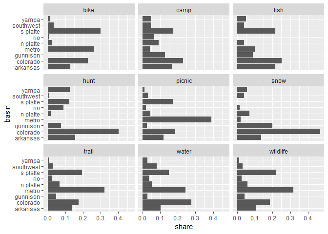

Getting basin share of days
================
February 07, 2020

``` r
library(tidyverse)
svy <- readRDS("../data-work/1-svy/svy-final.rds")
svy$basin <- svy$basin %>%
    left_join(select(svy$person, Vrid, weight))
```

## Calculate Share

``` r
# basin rate for activity participants
rate <- svy$basin %>%
    group_by(act, basin, part_water) %>%
    summarise(wtn = sum(weight)) %>%
    mutate(part_rate = wtn / sum(wtn)) %>%
    filter(part_water == "Checked")

# average basin days (for those who visit the basin)
avgDays <- svy$basin %>%
    filter(!is.na(days_water), part_water == "Checked") %>%
    group_by(act, basin) %>%
    summarise(avgDays = weighted.mean(days_water, weight), n = n())

# share of activity days for each basin
share <- avgDays %>%
    left_join(select(rate, act, basin, part_rate)) %>%
    mutate(
        days_per_participant = avgDays * part_rate,
        share = days_per_participant / sum(days_per_participant)
    )
```

    Joining, by = c("act", "basin")

## Plot

``` r
share %>%
    ggplot(aes(basin, share)) +
    geom_col() +
    coord_flip() +
    facet_wrap(~ act)
```

<!-- -->

## Sample Size

``` r
summarise(share, samp_size = sum(n), sum(share)) %>% knitr::kable()
```

| act      | samp\_size | sum(share) |
| :------- | ---------: | ---------: |
| bike     |        178 |          1 |
| camp     |        401 |          1 |
| fish     |        318 |          1 |
| hunt     |         49 |          1 |
| picnic   |        708 |          1 |
| snow     |         52 |          1 |
| trail    |        424 |          1 |
| water    |        318 |          1 |
| wildlife |        471 |          1 |

## Profile Table

``` r
knitr::kable(share)
```

| act      | basin     |   avgDays |   n | part\_rate | days\_per\_participant |     share |
| :------- | :-------- | --------: | --: | ---------: | ---------------------: | --------: |
| bike     | arkansas  | 16.013977 |  14 |  0.0861841 |              1.3801499 | 0.1287521 |
| bike     | colorado  |  8.577264 |  42 |  0.2855490 |              2.4492293 | 0.2284849 |
| bike     | metro     |  8.789424 |  52 |  0.3207743 |              2.8194216 | 0.2630196 |
| bike     | n platte  |  3.327189 |  12 |  0.0784068 |              0.2608743 | 0.0243366 |
| bike     | rio       |  2.413305 |   2 |  0.0317609 |              0.0766487 | 0.0071504 |
| bike     | s platte  | 10.391827 |  48 |  0.3076745 |              3.1973000 | 0.2982713 |
| bike     | southwest |  7.440670 |   5 |  0.0491960 |              0.3660509 | 0.0341483 |
| bike     | yampa     |  7.795847 |   3 |  0.0217758 |              0.1697611 | 0.0158368 |
| camp     | arkansas  |  4.167595 |  64 |  0.2073550 |              0.8641717 | 0.1657905 |
| camp     | colorado  |  3.430359 |  98 |  0.3498336 |              1.2000547 | 0.2302293 |
| camp     | gunnison  |  4.641493 |  49 |  0.1433351 |              0.6652889 | 0.1276350 |
| camp     | metro     |  2.502011 |  24 |  0.0881592 |              0.2205754 | 0.0423172 |
| camp     | n platte  |  5.761918 |  29 |  0.0832244 |              0.4795324 | 0.0919978 |
| camp     | rio       |  3.302354 |  26 |  0.1054457 |              0.3482191 | 0.0668055 |
| camp     | s platte  |  3.902803 |  72 |  0.2318668 |              0.9049305 | 0.1736100 |
| camp     | southwest |  3.597351 |  17 |  0.0736186 |              0.2648319 | 0.0508077 |
| camp     | yampa     |  3.575232 |  22 |  0.0740729 |              0.2648279 | 0.0508070 |
| fish     | arkansas  |  6.486147 |  61 |  0.2358129 |              1.5295168 | 0.2157281 |
| fish     | colorado  |  6.459646 |  67 |  0.2774353 |              1.7921337 | 0.2527684 |
| fish     | gunnison  |  4.419337 |  37 |  0.1414365 |              0.6250555 | 0.0881599 |
| fish     | metro     |  5.279534 |  31 |  0.1323852 |              0.6989324 | 0.0985797 |
| fish     | n platte  |  2.782860 |  28 |  0.1016493 |              0.2828759 | 0.0398977 |
| fish     | s platte  |  5.782456 |  65 |  0.2630446 |              1.5210435 | 0.2145330 |
| fish     | southwest |  6.164783 |  12 |  0.0448211 |              0.2763126 | 0.0389720 |
| fish     | yampa     |  5.705827 |  17 |  0.0638210 |              0.3641516 | 0.0513611 |
| hunt     | arkansas  |  8.926077 |   6 |  0.1005785 |              0.8977716 | 0.1545586 |
| hunt     | colorado  |  4.932258 |  16 |  0.4719578 |              2.3278179 | 0.4007525 |
| hunt     | gunnison  |  3.943108 |   4 |  0.1115901 |              0.4400118 | 0.0757516 |
| hunt     | n platte  |  1.507599 |   3 |  0.0723655 |              0.1090981 | 0.0187821 |
| hunt     | rio       |  6.572352 |   4 |  0.0803130 |              0.5278455 | 0.0908728 |
| hunt     | s platte  |  4.460003 |   9 |  0.1603270 |              0.7150588 | 0.1231031 |
| hunt     | southwest |  1.249310 |   3 |  0.0472344 |              0.0590103 | 0.0101591 |
| hunt     | yampa     |  8.062857 |   4 |  0.0907870 |              0.7320029 | 0.1260202 |
| picnic   | arkansas  |  5.625058 | 110 |  0.1837102 |              1.0333805 | 0.1192956 |
| picnic   | colorado  |  5.781984 | 136 |  0.2763680 |              1.5979552 | 0.1844713 |
| picnic   | gunnison  |  2.971648 |  47 |  0.0743760 |              0.2210193 | 0.0255149 |
| picnic   | metro     | 15.412149 | 117 |  0.2196172 |              3.3847733 | 0.3907454 |
| picnic   | n platte  |  4.506274 |  49 |  0.0859901 |              0.3874949 | 0.0447332 |
| picnic   | rio       |  3.305468 |  26 |  0.0561149 |              0.1854860 | 0.0214129 |
| picnic   | s platte  |  5.103538 | 167 |  0.2902319 |              1.4812095 | 0.1709940 |
| picnic   | southwest |  5.101918 |  29 |  0.0515791 |              0.2631522 | 0.0303788 |
| picnic   | yampa     |  2.355548 |  27 |  0.0457979 |              0.1078792 | 0.0124538 |
| snow     | arkansas  |  2.463418 |   6 |  0.1341659 |              0.3305067 | 0.1349700 |
| snow     | colorado  |  2.152970 |  24 |  0.5333502 |              1.1482872 | 0.4689294 |
| snow     | gunnison  |  2.549193 |   8 |  0.1914774 |              0.4881130 | 0.1993321 |
| snow     | metro     |  1.565373 |   2 |  0.0314875 |              0.0492898 | 0.0201286 |
| snow     | n platte  |  2.506906 |   4 |  0.0665909 |              0.1669371 | 0.0681726 |
| snow     | rio       |  1.000000 |   2 |  0.0325787 |              0.0325787 | 0.0133043 |
| snow     | southwest |  1.143660 |   5 |  0.0837112 |              0.0957371 | 0.0390964 |
| snow     | yampa     |  5.000000 |   1 |  0.0274585 |              0.1372925 | 0.0560665 |
| trail    | arkansas  |  6.529669 |  55 |  0.2091181 |              1.3654718 | 0.1353536 |
| trail    | colorado  |  4.590699 |  95 |  0.3846165 |              1.7656584 | 0.1750225 |
| trail    | gunnison  |  3.947532 |  30 |  0.1207270 |              0.4765737 | 0.0472408 |
| trail    | metro     | 11.254398 |  76 |  0.2874201 |              3.2347402 | 0.3206465 |
| trail    | n platte  |  4.885769 |  32 |  0.1388414 |              0.6783471 | 0.0672418 |
| trail    | rio       |  2.584936 |  19 |  0.0895297 |              0.2314285 | 0.0229406 |
| trail    | s platte  |  6.093392 |  86 |  0.3202316 |              1.9512963 | 0.1934240 |
| trail    | southwest |  4.207005 |  21 |  0.0770521 |              0.3241588 | 0.0321325 |
| trail    | yampa     |  1.597743 |  10 |  0.0378698 |              0.0605062 | 0.0059977 |
| water    | arkansas  |  5.047300 |  44 |  0.1398673 |              0.7059524 | 0.1030372 |
| water    | colorado  |  6.077029 |  83 |  0.3107855 |              1.8886525 | 0.2756582 |
| water    | gunnison  |  3.473582 |  16 |  0.0543398 |              0.1887539 | 0.0275496 |
| water    | metro     |  8.809911 |  54 |  0.1897052 |              1.6712863 | 0.2439325 |
| water    | n platte  |  4.844987 |  24 |  0.0753047 |              0.3648505 | 0.0532517 |
| water    | rio       |  3.170572 |  18 |  0.0813845 |              0.2580355 | 0.0376615 |
| water    | s platte  |  6.950262 |  48 |  0.1482474 |              1.0303583 | 0.1503859 |
| water    | southwest |  9.931577 |  15 |  0.0555586 |              0.5517847 | 0.0805357 |
| water    | yampa     |  2.915548 |  16 |  0.0657700 |              0.1917557 | 0.0279877 |
| wildlife | arkansas  |  5.264489 |  64 |  0.1962814 |              1.0333214 | 0.1069636 |
| wildlife | colorado  |  5.339502 |  85 |  0.3367632 |              1.7981478 | 0.1861341 |
| wildlife | gunnison  |  3.103814 |  43 |  0.1325930 |              0.4115442 | 0.0426007 |
| wildlife | metro     | 11.474737 |  77 |  0.2673935 |              3.0682704 | 0.3176100 |
| wildlife | n platte  |  5.249447 |  33 |  0.1073210 |              0.5633758 | 0.0583175 |
| wildlife | rio       |  3.435960 |  20 |  0.0682447 |              0.2344861 | 0.0242727 |
| wildlife | s platte  |  6.368796 | 109 |  0.3340721 |              2.1276368 | 0.2202409 |
| wildlife | southwest |  5.036120 |  20 |  0.0597254 |              0.3007842 | 0.0311355 |
| wildlife | yampa     |  2.092408 |  20 |  0.0587504 |              0.1229299 | 0.0127250 |
